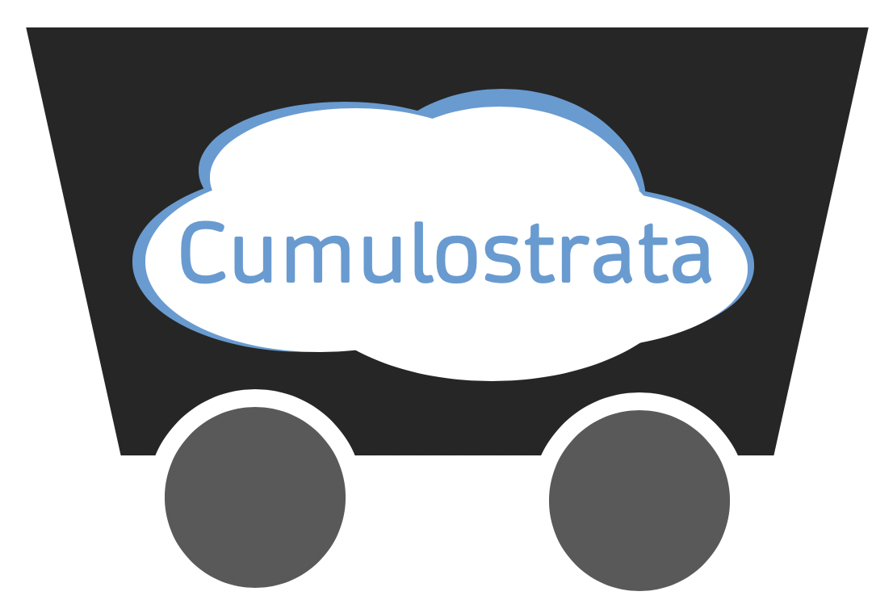

## Google Cloud to Splunk Terraform Automation

This project contains automation for sending data from GCP to Splunk. It will configure all parts of a data collection pipeline (Pub/Sub topics, schedulers, IAM service accounts, etc.) for GCS, Stackdriver Logging, and Stackdriver Metrics. 

Each directory contains information on the GCP data source supported by the Terraform template and what the included template will deploy, as well as deployment instructions.

## Contributions
The Cloud Functions deployed by the Terraform template come from [pauld-splunk](https://github.com/pauld-splunk)'s excellent work found in this [repository](https://github.com/splunk/splunk-gcp-functions)

The Dataflow template in the `stackdriver-dataflow-splunk-tf` template comes from the GCP provided template [here](https://cloud.google.com/dataflow/docs/guides/templates/provided-streaming#cloudpubsubtosplunk)

This repository is maintained by [@nstonesplunk](https://github.com/nstonesplunk)
